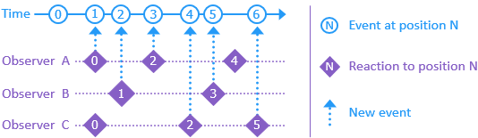

###  Totem vNext

A framework for building timeline-based applications on .NET

[Introduction](#introduction)

[Packages](#packages)

[License](#license)

[Getting Started](#getting-started)

[Help & Support](#help-support)

[Concepts](#concepts)

[Testing](#testing)

[Background](#background)

# Introduction

Totem organizes software as a timeline—a series of events flowing to interested observers. Each event occupies a distinct position in history and captures the circumstances of a decision. Observers work through events that interest them, at their own pace, absorbing information and appending new ones.



This is the heart of knowledge work: individuals and systems making and reacting to decisions over time. Observers develop unique pasts that inform their work, just as people do. Knowledge arises from this cycle, embodied by events and available for future consideration.

Totem vNext provides an environment for these interactions. Applications define events, commands, queries, topics, workflows, and reports. A framework built on .NET hosts the timeline, implementing delivery, persistence, and communication. The result is software that behaves more like the people using it.

## Purpose

People were doing knowledge work long before computers. We innately understand stories unfolding over time, yet most software is arranged spatially. This gap can make systems feel unnatural and hard to reason about.

Totem addresses the discord by framing work as a narrative, closer to how we communicate and learn, in hopes of making software more useful and accessible.

It strives to make storytelling the most valuable skill of software authors.

## Goals

**Repeatable solutions**  
Establish an application model with clear implementation guidance.

**Batteries included**  
Configure the timeline with sensible defaults and support overrides.

**Idiomatic .NET**  
Leverage ASP.NET Core, dependency injection, logging, and existing tooling wherever possible.

**Business intelligence**  
Capture data that can answer compelling future questions.

**Stable concept count**  
Keep the timeline easy to describe, reason about, and use.

# License

Totem is under the [MIT License](license.txt). Like knowledge, it wants to be free.

# Packages

This is a monorepo containing the Totem stack. Each project has a corresponding NuGet package.

| Project | Description |
|-|-|
| `Totem` | A collection of tools for common development scenarios in .NET |
| `Totem.Runtime` | Helpers for integrating with the .NET runtime |
| `Totem.Timeline` | The core elements and machinery of the timeline |
| `Totem.Timeline.EventStore` | Persistence for the timeline in an EventStore database |
| `Totem.Timeline.Mvc` | ASP.NET Core MVC integration with the timeline |
| `Totem.Timeline.SignalR` | ASP.NET Core SignalR integration with the timeline |
| `Totem.App.Service` | Base configuration for service applications, including the timeline and logging |
| `Totem.App.Tests` | Base configuration for testing applications with an in-memory timeline |
| `Totem.App.Web` | Base configuration for web applications, including MVC + SignalR bound to the timeline |

> Versions remain prerelease until internal systems are vetted longer in production.

# Getting Started

*A `dotnet new` experience for vNext is under construction.* Until then:

1. Create an area project that defines events, commands, queries, topics, workflows, and reports.
2. Create a service host that runs the area’s timeline.
3. Create a web host that issues commands and reads queries/reports via HTTP, MVC, or SignalR.
4. Use the examples in this repository as a reference for wiring up `AddTotemRuntime(...)`, HTTP endpoints, and hosting.

See the [App](#app) section for a description of solution structure.

# Help & Support

Questions and feedback are welcome in the `#totem` channel of the ddd-cqrs-es slack.

<sup><sub>There are many design decisions in a framework like this. Please assume the competence and best intentions of those behind Totem.</sub></sup>

# Concepts

[Event](#event)  
[Command](#command)  
[Query](#query)  
[Topic](#topic)  
[Workflow](#workflow)  
[Report](#report)  
[Route](#route)  
[Area](#area)  
[App](#app)

## Event

An event is a signal on the timeline of an environment. It captures the context of a decision made in the past:

```csharp
using Totem.Timeline;

namespace Acme.ProductImport;

public class ImportStarted : Event
{
  public ImportStarted(string reason) => Reason = reason;

  public readonly string Reason;
}
```

Here, the system decided conditions were right to start an import for the specified reason.

Events have past-tense names representing facts about the environment.

## Command

A command is a *choice* made.

Commands are expressed via marker interfaces to distinguish how they enter the system:

- **Workflow commands**: participate directly in the event-driven workflow graph (e.g., `IWorkflowCommand`).
- **HTTP commands**: arrive over HTTP boundaries (e.g., `IHttpCommand`) and are projected into workflow commands.

```csharp
using Totem;

namespace Acme.ProductImport;

public sealed class StartImport : IHttpCommand
{
  public StartImport(Id importId, string reason)
  {
    ImportId = importId;
    Reason = reason;
  }

  public Id ImportId { get; }
  public string Reason { get; }
}
```

```csharp
public sealed class UnpackImport : IWorkflowCommand
{
    public UnpackVersion(Id importId)
    {
        ImportId = importId;
    }

    public Id ImportId { get; }
}
```

Commands have imperative names representing instructions to the environment.

## Report

A `Report` is an observer that tallies events into a data structure comprised of rows.
The `Report` itself keeps the data shape, the `ReportRow` separate from routing and async concerns.

They differ from "projections" in that Totem manages their storage and checkpoints internally, and because they are full Timeline objects; they can maintain internal state that's never serialized, using `Given` to drive efficient updates to the public row.

```csharp
using Totem.Timeline;

namespace Acme.ProductImport.Reports;

public sealed class ImportSummaryRow : ReportRow
{
  public string Status { get; set; } = "";
}

public class ImportSummary : Report<ImportSummaryRow>
{
  public static Id Route(ImportFinished e) => e.ImportId;

  public void When(ImportFinished e)
  {
    Row.Status = "Finished";
  }
}
```

The `When` methods signal interest in those event types. The timeline calls them in order, fully completing one before moving onto the next.

The `ImportSummary` observer listens for `ImportFinished` events. For any given importId on those events, we write to the associated `ImportSummaryRow`, setting the Status of that import to "Finished".

Reports remember where they left off, allowing them to resume after restarts.

## Topic

A topic is an observer that maintains state and *adds* events to the timeline. Like queries, it uses `Given` to evolve state, but it also has `When` methods that make decisions:

```csharp
using Totem.Timeline;

namespace Acme.ProductImport.Topics;

public class ImportProcess : Topic
{
  bool _importing;

  void Given(ImportStarted e) => _importing = true;

  void Given(ImportFinished e) => _importing = false;

  void When(StartImport command)
  {
    if(_importing)
    {
      Then(new ImportAlreadyStarted());
    }
    else
    {
      Then(new ImportStarted(command.Reason));
    }
  }
}
```

A first `StartImport` results in `ImportStarted`. That becomes a new timeline position, which runs the `Given` handler and sets the flag to true. Any further `StartImport`s result in `ImportAlreadyStarted` until `ImportFinished` occurs and resets the state.

All events sent to `Then` go to the timeline *after* `When` completes, with the cause set to the current position.

A topic may have any combination of `Given` and `When` methods for events. If both are present for the same event, `Given` runs first so `When` can see the new state.

### Interacting with the world

Topics act *in the now*, making them ideal for working with external systems. Dependencies are supplied via dependency injection (for example in constructors) and, when needed, `CancellationToken`s passed into `When` methods:

```csharp
using Dream.Versions;

namespace Dream.Versions.Topics;

public sealed class DownloadTopic : Topic
{
  public static Id Route(DownloadVersion command) => command.VersionId;

  readonly IDownloadService _service;

  public DownloadTopic(IDownloadService service) =>
    _service = service;

  public async Task When(DownloadVersion command, CancellationToken cancellationToken)
  {
    if(!Uri.TryCreate(command.ZipUrl, UriKind.Absolute, out var zipUrl))
    {
      ThenError(VersionErrors.ParseZipUrlFailed);
      return;
    }

    try
    {
      var file = await _service.DownloadAsync(zipUrl, cancellationToken);

      Then(new VersionDownloaded(command.VersionId, command.ZipUrl, file.Path.ToString(), file.ByteCount));
    }
    catch(Exception exception)
    {
      Then(new DownloadVersionFailed(command.VersionId, command.ZipUrl, exception.ToString()));
    }
  }
}
```

`When` methods support asynchronous operations; the topic does not move to the next event until the `Task` completes, and can emit both domain events and error results (for example via `Then` and `ThenError`).

## Workflow

A workflow connects decisions (events) to follow-up choices (commands). Where topics generally make domain decisions and emit events, workflows are about *orchestrating* further work.

```csharp
using Totem.Timeline;

namespace Acme.ProductImport.Workflows;

public class ImportFlow : Workflow
{
  public static Id Route(ImportRequested e) => e.ImportId;

  public void When(ImportRequested e) =>
    ThenEnqueue(new StartImport(e.ImportId, e.Reason));
}
```

Workflows:

- observe events via `When`
- enqueue follow-up commands via `ThenEnqueue`

## Route

The types above can have single or multiple instances. `Route` methods determine which instances observe an event or command:

```csharp
using Totem;
using Totem.Timeline;

namespace Acme.ProductImport.Queries;

public class ProductDetails : Query
{
  static Id Route(ProductAdded e) => e.ProductId;
  static Id Route(ProductIncluded e) => e.ProductId;
  static Id Route(ProductExcluded e) => e.ProductId;

  public string Name;
  public bool IsIncluded;

  void Given(ProductAdded e) =>
    Name = e.Name;

  void Given(ProductIncluded e) =>
    IsIncluded = true;

  void Given(ProductExcluded e) =>
    IsIncluded = false;
}
```

## Area

An area is a family of events, queries, topics, workflows, and reports sharing a timeline. It forms the boundary for concepts and language within, exposing well-defined inputs and outputs.

The primary difference between areas is the decisions they own. Like teams in a company, they are focused parts of a larger whole, each responsible for a portion of the domain.

This partitioning of work leads to more communication; workflows and topics make these touchpoints explicit concerns.

## App

An app configures an area for hosting by the framework. It typically produces:

- a **service** that hosts the timeline
- an optional **web server** that interacts with the service

A common solution structure:

```
Acme.ProductImport.sln
  Acme.ProductImport           // area: events, queries, topics, workflows, reports
  Acme.ProductImport.Service   // timeline host
  Acme.ProductImport.Web       // web / HTTP host
```

The area declares a marker type:

```csharp
using Totem.Timeline.Hosting;

namespace Acme.ProductImport;

public sealed class ProductImportArea : TimelineArea
{}
```

The service project runs the area:

```csharp
using System.Threading.Tasks;
using Totem.App.Service;

namespace Acme.ProductImport.Service;

public static class Program
{
  public static Task Main() =>
    ServiceApp.Run<ProductImportArea>(services =>
      services.AddProductImport());
}
```

The web project runs a client that sends commands and reads queries/reports:

```csharp
using System.Threading.Tasks;
using Totem.App.Web;

namespace Acme.ProductImport.Web;

public static class Program
{
  public static Task Main() =>
    WebApp.Run<ProductImportArea>();
}
```

The web host:

- issues commands (e.g., via `ICommandServer`)
- reads queries and reports (e.g., via `IQueryServer` / `IReportServer`)
- uses HTTP verbs (`GET`, `POST`, `PUT`, `DELETE`, etc.) to express intent

### Reading queries with `GET`

```csharp
using System.Threading.Tasks;
using Acme.ProductImport.Queries;
using Microsoft.AspNetCore.Mvc;
using Totem.Timeline.Mvc;

namespace Acme.ProductImport.Web.Controllers;

[ApiController]
public class ImportsController : ControllerBase
{
  [HttpGet("/api/imports")]
  public Task<IActionResult> GetStatus([FromServices] IQueryServer queries) =>
    queries.Get<ImportStatus>();
}
```

Responses include a version (e.g., via `ETag`) based on the last observed timeline position, enabling caching and optimistic concurrency.

### Issuing commands with `POST`/`PUT`/`DELETE`

```csharp
using System.Threading.Tasks;
using Microsoft.AspNetCore.Mvc;
using Totem.Timeline.Mvc;

namespace Acme.ProductImport.Web.Controllers;

[ApiController]
public class ImportsController : ControllerBase
{
  [HttpPost("/api/imports")]
  public Task<IActionResult> StartImport([FromServices] ICommandServer commands) =>
    commands.Execute(
      new StartImport(reason: "Requested"),
      When<ImportStarted>.ThenOk,
      When<ImportAlreadyStarted>.ThenConflict);
}
```

The command enters the timeline, topics and workflows handle it, and resulting events determine the HTTP response.

# Testing

`Totem.App.Tests` supports automated testing of queries, topics, workflows, and reports. Each test spins up a full .NET Core app hosting an in-memory timeline. This isolation lets tests run in parallel without conflict.

Timeline tests focus on a single type under test, ignoring everything else. Test base classes provide a small API for interacting with the timeline.

## Queries

Extend `QueryTests<TQuery>` to test a query:

```csharp
using Acme.ProductImport.Queries;
using Totem.App.Tests;

public class ImportStatusTests : QueryTests<ImportStatus>
{
  [Fact]
  public async Task ImportStarted()
  {
    await Append(new ImportStarted("Testing"));

    var query = await GetQuery();

    Expect(query.Importing).IsTrue();
    Expect(query.Reason).Is("Testing");
  }
}
```

Typical helpers:

1. `Append(Event)` puts events on the timeline.
2. `GetQuery()` reads the current query state.

## Topics

Extend `TopicTests<Topic>` to test a topic:

```csharp
using Acme.ProductImport.Topics;
using Totem.App.Tests;

public class ImportProcessTests : TopicTests<ImportProcess>
{
  [Fact]
  public async Task StartTwice()
  {
    await Append(new StartImport("Testing"));
    await Expect<ImportStarted>();

    await Append(new StartImport("Testing again"));
    await Expect<ImportAlreadyStarted>();
  }
}
```

Helpers:

- `Append(Event)` puts events on the timeline.
- `Expect<TEvent>()` waits for and asserts the next event.
- `Services` allows registration of test doubles for dependencies.

Dependencies declared in `When` method parameters (e.g., file or database abstractions) can be substituted:

```csharp
[Fact]
public async Task DiffProducts()
{
  Services.AddSingleton<IProductFile, FakeProductFile>();

  await Append(new ImportStarted("Testing"));

  var diffed = await Expect<ProductsDiffed>();

  Expect(diffed.AddedProducts.Count).Is(1);
}
```

## Workflows and Reports

Similarly, workflow and report tests exercise orchestration and read models:

- Workflow tests: append an event, assert that expected commands are enqueued.
- Report tests: append events, read rows from the report projection.

# Background

Totem synthesizes ideas from several design paradigms:

- Domain-Driven Design
- Command Query Responsibility Segregation (CQRS)
- Event Sourcing
- Actor Model
- Microservices
- Event Storming

These approaches shape the timeline’s focus on collaboration, knowledge, and change over time. People are the most complex aspect of software; Totem treats them—and their decisions—as first-class concerns.

Totem grew up at DealerOn and powers several critical systems.

*The logo is the spinning top from Inception, called a totem. It represents the history unique to each of us.*

## Further Reading

[Finding Humanity in Software](https://dev.to/dealeron/finding-humanity-in-software-5a45)  
*A look at system design through the lens of human activity*

[The Myth of Software Collaboration](https://dev.to/dealeron/the-myth-of-software-collaboration-1126)  
*Exploring why our systems feel lonely*
